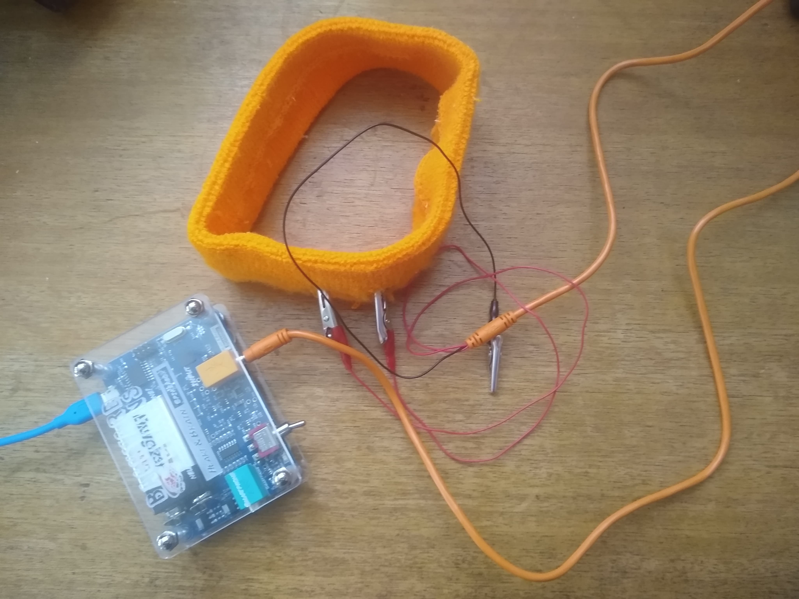
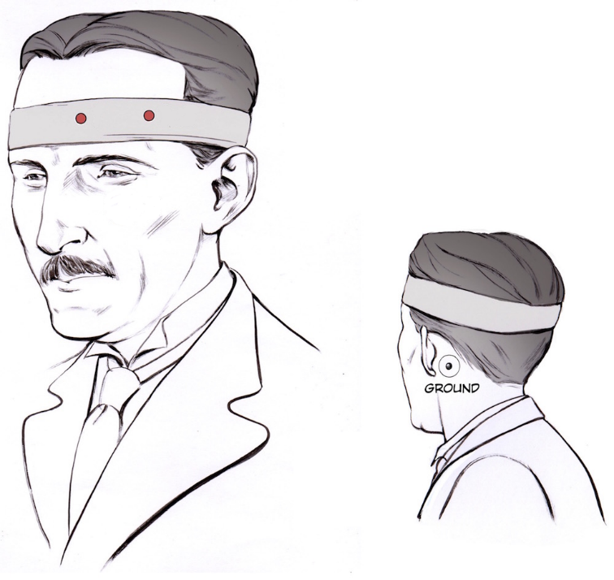
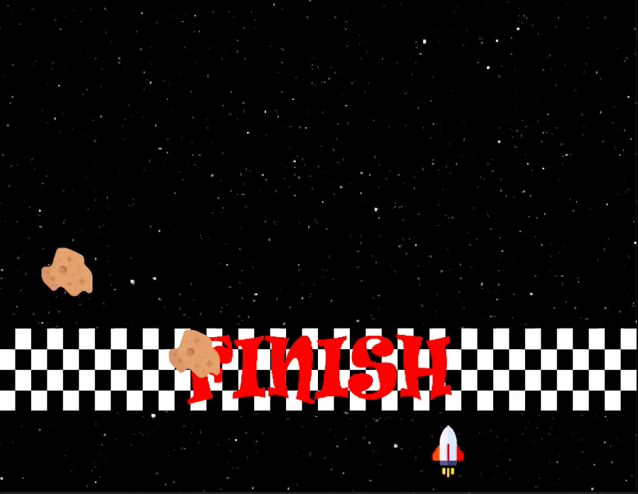
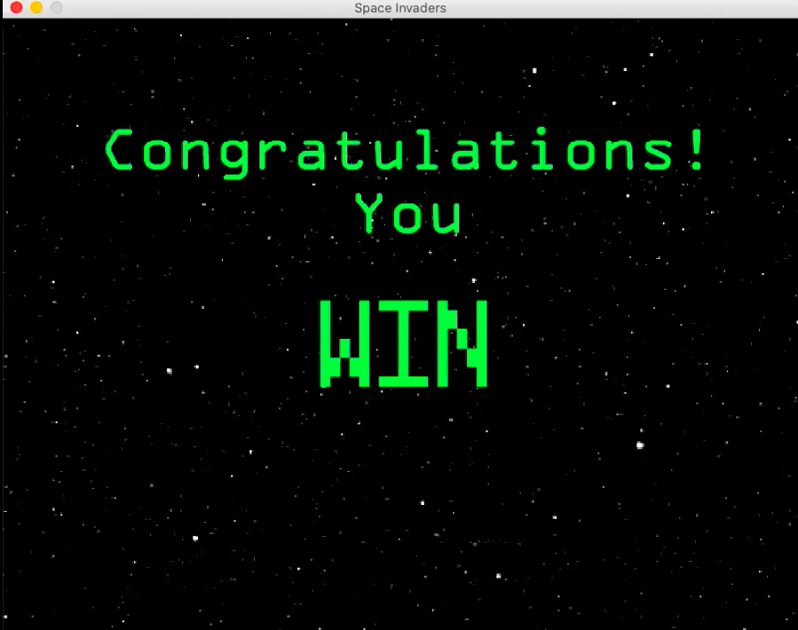
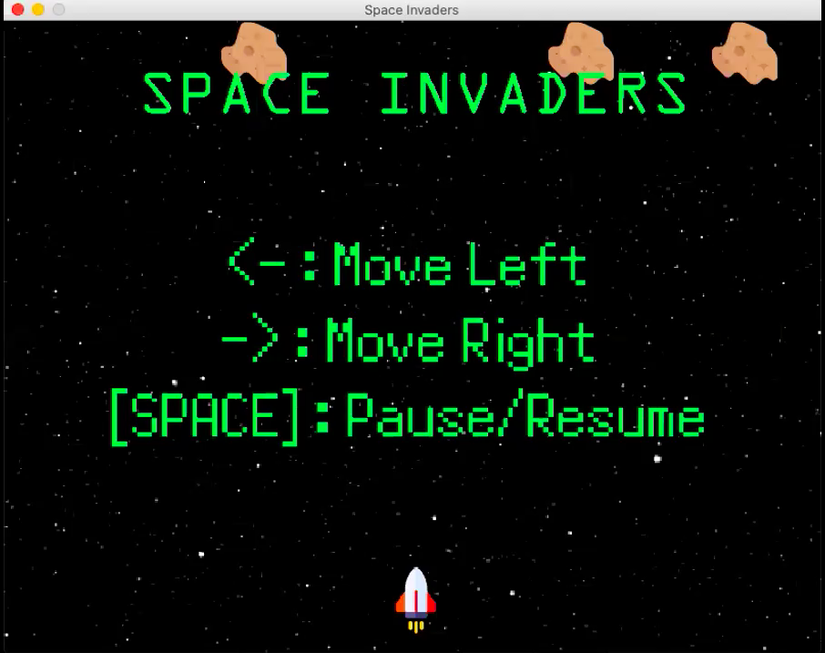
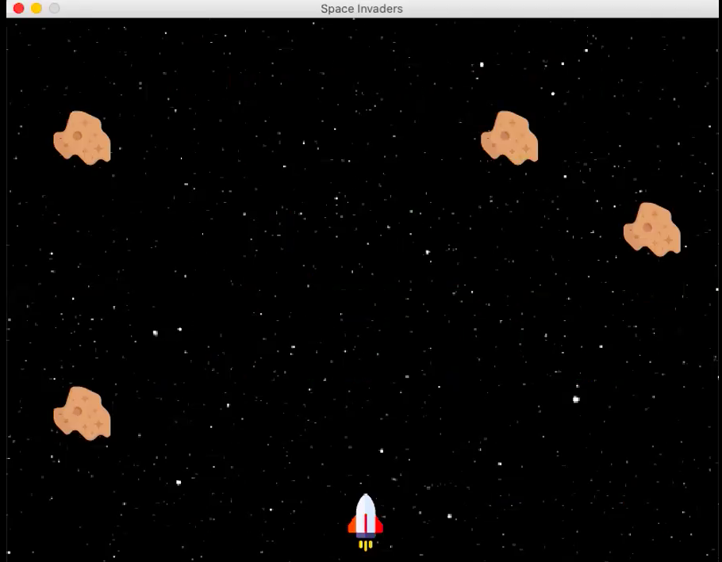
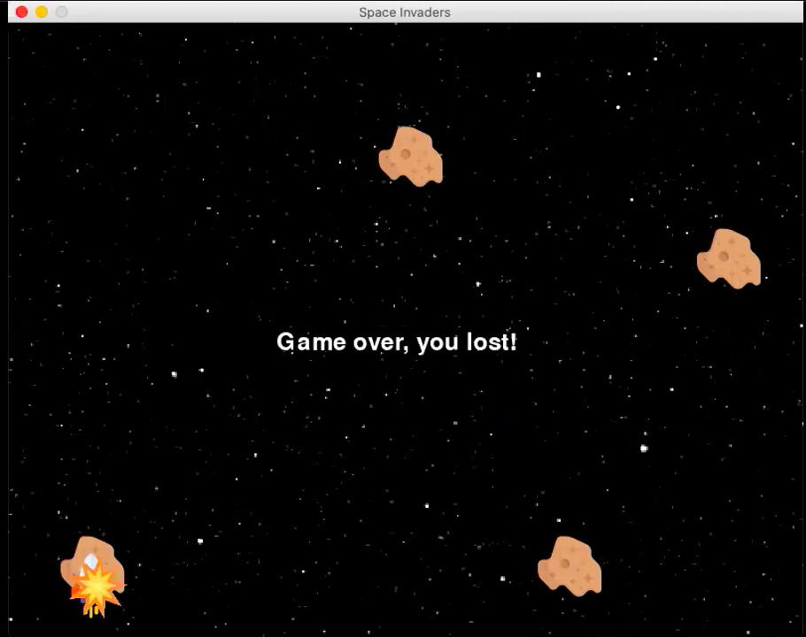

# Space Invaders

This game is a space invaders game where the controller is a spike box.

The game needs the spike box otherwise it does not run. The box read EEG waves of a person where the wave changes according to left and right eye movement. If you look left, the spaceship moves left, if you look right, the spaceship moves right.

The game itself is made from programs in the following folders:

* Field
* Object
* Factor
* images

The controller is a classification algorithm from sklearn package. The data trained is in the *data* folder and the classification codes are in the *Classifier* and *data* folder. There are many classification models: Random Forest, SVM and a classifier we wrote ourselves

There is also a **filter.py** program that receive the input from the spike box and return a wave sequence

For more information, read the **Report** Jupter Notebook.

## Demo

### Win scenario

### Lose scenario

